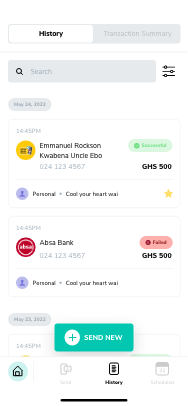

# Hubtel's App Interface

This is a Flutter application that demonstrates a one-page hubtel design with an initial loading screen. The app simulates a transaction history page with a progress indicator to show an initial page load before the data is rendered.

## Table of Contents

- [Introduction](#introduction)
- [Features](#features)
- [Screenshots](#screenshots)
- [Installation](#installation)
- [Usage](#usage)
- [Contributing](#contributing)
- [License](#license)

## Introduction

The One Page App is built using Flutter and showcases a clean and modern UI for displaying transaction history. The app includes a loading indicator during data fetch and presents the data in a well-structured format.

## Features

- Initial loading screen with a circular progress indicator.
- Transaction history display.
- Responsive and adaptive UI.
- Clean and maintainable code structure.

## Screenshots



## Installation

To run this project locally, follow these steps:

1. **Clone the repository:**

   ```bash
   git clone https://github.com/your-username/one-page-app.git
   ```

2. **Navigate to the project directory:**

   ```bash
   cd one-page-app
   ```

3. **Install dependencies:**

   ```bash
   flutter pub get
   ```

4. **Run the app:**

   ```bash
   flutter run
   ```

## Usage

Once the app is running, you will see an initial loading screen. After a short delay, the transaction history page will be displayed with sample transaction data.

## Contributing

Contributions are welcome! If you would like to contribute to this project, please follow these steps:

1. Fork the repository.
2. Create a new branch for your feature or bug fix.
3. Commit your changes and push your branch to your forked repository.
4. Create a pull request with a description of your changes.

## License

This project is licensed under the MIT License - see the [LICENSE](LICENSE) file for details.

## Contact

If you have any questions or feedback, feel free to contact me at [alberttheodorelutterodt@gmail.com](mailto:alberttheodorelutterodt@gmail.com).
